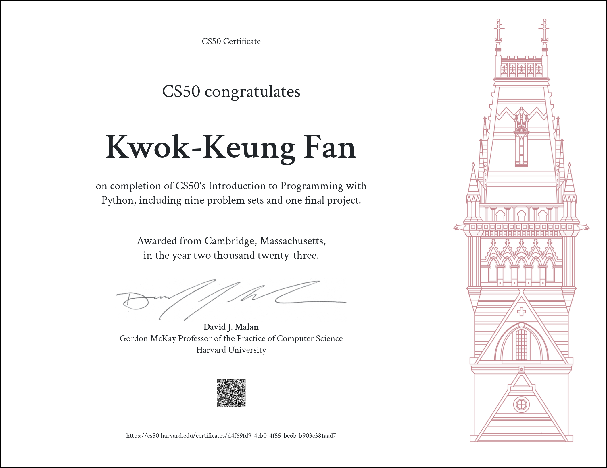

# CS50’s Introduction to Programming with Python

### These are my solutions for CS50's Introduction to Programming with Python 2023.
 
 

## Table of Contents
### [Functions, Variables](https://cs50.harvard.edu/python/2022/weeks/0/)
- [Indoor Voice](/indoor/)
- [Playback Speed](/playback/)
- [Making Faces](/faces/)
- [Einstein](/einstein/)
- [Tip Calculator](/tip/)

### [Conditionals](https://cs50.harvard.edu/python/2022/weeks/1/)
- [Deep Thought](/deep/)
- [Home Federal Savings Bank](/bank/)
- [File Extensions](/extensions/)
- [Math Interpreter](/interpreter/)
- [Meal Time](/meal/)

### [Loops](https://cs50.harvard.edu/python/2022/weeks/2/)
- [camelCase](/camel/)
- [Coke Machine](/coke/)
- [Just setting up my twttr](/twttr/)
- [Vanity Plates](/plates/)
- [Nutrition Facts](/nutrition/)

### [Exceptions](https://cs50.harvard.edu/python/2022/weeks/3/)
- [Fuel Gauge](/fuel/)
- [Felipe's Taqueria](/taqueria/)
- [Grocery List](/grocery/)
- [Outdated](/outdated/)

### [Libraries](https://cs50.harvard.edu/python/2022/weeks/4/)
- [Emojize](/emojize/)
- [Frank, Ian and Glen's Letters](/figlet/)
- [Adieu, Adieu](/adieu/)
- [Guessing Game](/game/)
- [Little Professor](/professor/)
- [Bitcoin Price Index](/bitcoin/)

### [Unit Tests](https://cs50.harvard.edu/python/2022/weeks/5/)
- [Testing my twttr](/test_twttr/)
- [Back to the Bank](/test_bank/)
- [Re-requesting a Vanity Plate](/test_plates/)
- [Refueling](/test_fuel/)

### [File I/O](https://cs50.harvard.edu/python/2022/weeks/6/)
- [Lines of Code](/lines/)
- [Pizza Py](/pizza/)
- [Scourgify](/scourgify/)
- [CS50 P-Shirt](/shirt/)

### [Regular Expressions](https://cs50.harvard.edu/python/2022/weeks/7/)
- [NUMB3RS](/numb3rs/)
- [Watch on YouTube](/watch/)
- [Working 9 to 5](/working/)
- [Regular, um, Expressions](/um/)
- [Response Validation](/response/)

### [Object-Oriented Programming](https://cs50.harvard.edu/python/2022/weeks/8)
- [Seasons of Love](/seasons/)
- [Cookie Jar](/jar/)
- [CS50 Shirtificate](/shirtificate/)